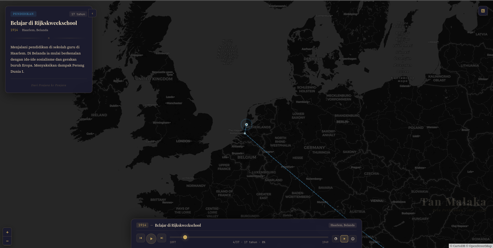

# Tan Malaka — Peta Perjalanan Hidup

Peta interaktif perjalanan hidup **Tan Malaka** (1897–1949), revolusioner dan pahlawan nasional Indonesia. Terinspirasi dari proyek [mao-map](https://github.com/sansan0/mao-map).

Data disusun berdasarkan autobiografi **"Dari Penjara ke Penjara"** dan sumber-sumber sejarah lainnya.

## Preview



## Tech Stack

- [SvelteKit](https://kit.svelte.dev/) — Framework
- [Leaflet.js](https://leafletjs.com/) — Peta interaktif
- [CartoDB Dark Matter](https://carto.com/basemaps/) — Tile layer
- [Playfair Display](https://fonts.google.com/specimen/Playfair+Display) & [Source Serif 4](https://fonts.google.com/specimen/Source+Serif+4) — Tipografi

## Cara Menjalankan

```bash
# Install dependencies
npm install

# Jalankan development server
npm run dev

# Build untuk production
npm run build
```

## Sumber Data

- **Dari Penjara ke Penjara** — Tan Malaka (autobiografi)
- Wikipedia — [Tan Malaka](https://en.wikipedia.org/wiki/Tan_Malaka)
- Britannica — [Tan Malaka](https://www.britannica.com/biography/Tan-Malaka)

## Lisensi

MIT
